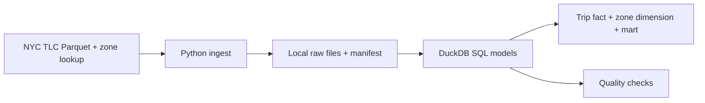

# Project 1 — NYC TLC batch analytics

**Status: planned.** Build a local analytics pipeline over official [NYC Taxi & Limousine Commission trip records](https://www.nyc.gov/site/tlc/about/tlc-trip-record-data.page). The public dataset contains taxi and for-hire vehicle records; it is not Uber internal data. Start with one manageable monthly Parquet file and the official taxi-zone lookup.

## Question and design

Which zones and hours have the most trips, and how do trip volume, duration, and fare change month to month? Python handles acquisition and run metadata. DuckDB reads Parquet and runs SQL transformations. A small analytical model should contain a trip fact table, a zone dimension, and a daily or hourly aggregate. Record the source month and transformation version so results can be reproduced.

## Milestone 1 — First useful run

- Create a small Python command that accepts a year and month, validates them, downloads one TLC Parquet file, and records the source URL, download time, file size, and hash.
- Query the file with DuckDB. Output the trip count and trips by pickup hour and zone. Document one command that works from a clean Python environment on Windows.
- Fail clearly for an invalid month, an unavailable source file, or an incomplete download. Do not commit the downloaded dataset.

**Review gate:** a fresh run produces the stated counts, and a second run handles the already-downloaded file deliberately rather than silently producing another copy.

## Milestone 2 — Analytical model and quality

- Add typed staging SQL, a trip fact, a zone dimension, and an aggregate that answers the question above. Document grain, keys, null handling, and any excluded records.
- Add checks for duplicate trip keys where a reliable key exists, missing zones, invalid timestamps, negative duration or fares, and source-to-stage count differences. If the source lacks a stable trip ID, document a defensible composite key or avoid claiming row-level deduplication.
- Verify the model against a second month. Add dbt only after the plain SQL model is understandable and working.

**Review gate:** the checks fail on at least one deliberately bad fixture and pass on the documented valid run; the aggregate ties back to source counts after stated exclusions.

## Milestone 3 — Reruns and backfills

- Make a rerun idempotent and support reprocessing one earlier month. Show before/after row counts and an unchanged aggregate on an unchanged rerun.
- Add one automated command for checks and document runtime, source size, known data quality issues, and tradeoffs.

**Done when:** another engineer can reproduce two months of results, rerun one month without double counting, see tests pass, and understand how an input or transformation failure is recovered.

## Scope limits

No cloud, Docker, Spark, Kafka, orchestration service, or dashboard is required for the first complete version. They can be introduced only if they solve a measured limitation. Keep public dataset licensing and attribution in the final README.
