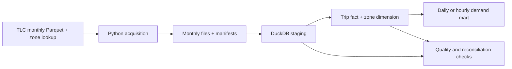

# NYC TLC batch analytics

**Status: In progress.** Monthly yellow-taxi ingestion, download-size validation, and source manifests are implemented. Taxi-zone lookup ingestion and DuckDB analytical queries are planned.

## Problem

The [NYC Taxi & Limousine Commission (TLC)](https://www.nyc.gov/site/tlc/about/tlc-trip-record-data.page) publishes monthly trip records and a taxi-zone lookup. This project will turn those public files into reproducible answers about trip demand by pickup zone and hour, plus monthly changes in trip volume, duration, and fare.

## Windows quickstart

Prerequisites: Git, Python 3.13 with the Windows `py` launcher, and internet access for dependency installation and the initial download. Run these commands in PowerShell from the directory where you want the repository:

```powershell
git clone https://github.com/olivervr3/data-engineering-portfolio.git
cd data-engineering-portfolio\01-tlc-batch-analytics
py -3.13 -m venv .venv
.\.venv\Scripts\python.exe -m pip install -r requirements.txt
.\.venv\Scripts\python.exe ingest.py --year 2024 --month 1
```

For an existing checkout, start in this project directory and reuse its virtual environment. The commands call that environment's interpreter directly, so activation is optional. DuckDB is pinned for the planned analytical stage; ingestion itself uses Python's standard library.

Each invocation selects one month of yellow-taxi data. The command requires an integer year and a month from 1 to 12. Source availability is determined by the HTTP response; an unavailable monthly file causes the command to fail.

The script resolves its output directory relative to `ingest.py` and creates it when needed:

```text
data/raw/
  yellow_tripdata_2024-01.parquet
  yellow_tripdata_2024-01.manifest.json
```

Inspect the recorded metadata from the project directory:

```powershell
Get-Content .\data\raw\yellow_tripdata_2024-01.manifest.json -Raw
```

The repository ignores the raw and processed data directories, including generated manifests and temporary files. Their contents are local run artifacts.

## Source manifest and repeat runs

Each monthly Parquet file has a separate UTF-8 JSON manifest. The record makes the selected input identifiable for subsequent analysis.

| Field | Meaning |
| --- | --- |
| `source_url` | The expected NYC TLC download URL for the selected year and month. |
| `retrieved_at_utc` | ISO 8601 UTC timestamp recorded after a new download is complete, or `null` when the original retrieval time is unknown. |
| `file_size_bytes` | The local Parquet file's size in bytes. |
| `sha256` | The SHA-256 digest of the file's contents, represented as a 64-character hexadecimal string. |

The January 2024 file already present during development produced this manifest. Its retrieval time had not been recorded:

```json
{
  "source_url": "https://d37ci6vzurychx.cloudfront.net/trip-data/yellow_tripdata_2024-01.parquet",
  "retrieved_at_utc": null,
  "file_size_bytes": 49961641,
  "sha256": "c4d59da7bbc8abaeeeb1727947ee93d9891a71acb42854bd80db1571b2030510"
}
```

Running the command again follows the state of the local files:

| Local state | Behavior |
| --- | --- |
| Data file missing | Download it, calculate its metadata, and write a manifest with the new retrieval timestamp. |
| Data file present, manifest missing | Skip the download and create a manifest from the existing bytes, with `retrieved_at_utc: null`. |
| Data file and manifest present | Skip the download, compare the expected URL, current size, and current checksum against the saved record, and preserve the manifest if they match. A mismatch raises an error. |

A recovered manifest establishes a baseline for the bytes currently on disk. Its expected source URL does not independently prove where a pre-existing file was obtained. Reuse makes no HTTP request, so it does not detect a publisher replacing a remote file. The recorded hash is calculated locally rather than compared with a publisher-provided checksum.

## File publication and failure handling

Downloads are streamed with a 30-second request timeout into a sibling `.parquet.part` file. After the output is closed, its size is checked against `Content-Length` when that header is present. Only a successful download is moved to the final Parquet path. Caught download errors remove the partial file and propagate a failure.

The shared `write_manifest()` function receives a complete metadata dictionary, writes it to a sibling `.manifest.json.tmp` file, closes that file, and replaces the final manifest. Caught write or replacement errors remove the temporary file and propagate the error. A failed write leaves any previous manifest intact.

Publishing the data file and publishing its manifest are separate operations. If manifest writing fails, a completed Parquet file can remain; a later run can create the missing manifest with an unknown retrieval time. An existing malformed or mismatched manifest stops the run and requires investigation.

These checks cover transfer size and local file integrity. Parquet structure, schema, and analytical data quality checks remain planned. Run one ingestion process per month at a time; concurrent writes to the same paths are outside the current scope.

## Target architecture

The diagram includes the planned analytical stages. The implemented path currently ends at the monthly raw files and their manifests.



Python acquires a specified year and month and records the source URL, retrieval time, size, and file hash. The next stage will use DuckDB to query the Parquet files directly; SQL models will produce typed staging tables, a trip fact, a zone dimension, and a demand mart. The intended fact grain is one accepted source trip record. Analytical reloads are planned to replace a month's results; row-level deduplication requires a separate assessment of the available source keys.

## Implementation milestones

1. **Acquisition and baseline query:** parameterized download of one monthly file and the zone lookup; a manifest and a documented local command; trip counts by pickup hour and zone.
2. **Analytical model:** typed staging, documented grain and exclusion rules, fact and dimension tables, a demand mart, and a second source month to test changes across files.
3. **Repeatable operation:** month-level reload and backfill, automated quality checks, a clean-environment runbook, and recorded input size and runtime.

## Ingestion tests

From this project directory, run:

```powershell
.\.venv\Scripts\python.exe -m unittest discover -s tests -v
```

The suite contains eight tests and uses Python's standard library. Each test runs a temporary copy of `ingest.py` from a separate working directory, using simulated HTTP responses. Assertions cover successful downloads, repeat runs, interrupted transfers, HTTP errors, timeouts, missing content-length headers, truncated responses, and invalid CLI arguments. Test payloads are small byte strings; Parquet structure and analytical data quality are outside these tests.

The current suite exercises manifest creation as part of successful ingestion but does not directly assert manifest fields or failure recovery. Dedicated manifest regression tests and automated execution in GitHub Actions remain pending.

For a reproducible CLI validation failure, use an invalid month:

```powershell
.\.venv\Scripts\python.exe ingest.py --year 2024 --month 13
```

Expected result: an argparse `invalid choice` message and exit code 2, before any download.

## Acceptance criteria

- A complete download is distinguishable from an interrupted one, and invalid or unavailable months produce a clear failure.
- Source, staging, exclusions, and fact counts reconcile for two months. Missing zone matches, invalid timestamps, and suspect duration or fare values are reported with explicit treatment.
- At least one deliberately invalid fixture fails its corresponding check.
- Reloading an unchanged month leaves fact counts and mart values unchanged; backfilling one month does not modify another.
- The repository records the source URLs, transformation version, commands, checks, and observed results once implemented.

## Scope and tradeoffs

Local DuckDB and Parquet keep the first version reproducible without a cloud account or container runtime. A scheduler, dashboard, Spark, and distributed storage are outside this design until scale or operational requirements warrant them.
