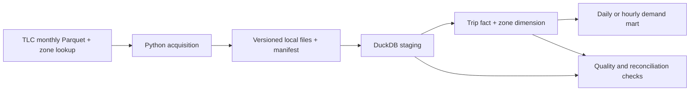

# NYC TLC batch analytics

**Status: Design stage.** Implementation pending.

## Problem

The [NYC Taxi & Limousine Commission (TLC)](https://www.nyc.gov/site/tlc/about/tlc-trip-record-data.page) publishes monthly trip records and a taxi-zone lookup. This project will turn those public files into reproducible answers about trip demand by pickup zone and hour, plus monthly changes in trip volume, duration, and fare.

## Proposed architecture

Python will acquire a specified year and month and record the source URL, retrieval time, size, and file hash. DuckDB will query the Parquet files directly; SQL models will produce typed staging tables, a trip fact, a zone dimension, and a demand mart. The intended fact grain is one accepted source trip record. The design uses month-level replacement for repeatable loads; row-level deduplication requires a separate assessment of the available source keys.

## Implementation milestones

1. **Acquisition and baseline query:** parameterized download of one monthly file and the zone lookup; a manifest and a documented local command; trip counts by pickup hour and zone.
2. **Analytical model:** typed staging, documented grain and exclusion rules, fact and dimension tables, a demand mart, and a second source month to test changes across files.
3. **Repeatable operation:** month-level reload and backfill, automated quality checks, a clean-environment runbook, and recorded input size and runtime.

## Acceptance criteria

- A complete download is distinguishable from an interrupted one, and invalid or unavailable months produce a clear failure.
- Source, staging, exclusions, and fact counts reconcile for two months. Missing zone matches, invalid timestamps, and suspect duration or fare values are reported with explicit treatment.
- At least one deliberately invalid fixture fails its corresponding check.
- Reloading an unchanged month leaves fact counts and mart values unchanged; backfilling one month does not modify another.
- The repository records the source URLs, transformation version, commands, checks, and observed results once implemented.

## Scope and tradeoffs

Local DuckDB and Parquet keep the first version reproducible without a cloud account or container runtime. A scheduler, dashboard, Spark, and distributed storage are outside this design until scale or operational requirements warrant them. Public data attribution and any dataset usage terms will be included with the implemented result.
