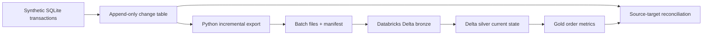

# Operational database to lakehouse

**Status: Design stage.** Implementation pending.

## Problem

Analytical tables need to reflect inserts, updates, cancellations, and deletes from a transactional source while tolerating repeated batches and interrupted runs. The proposed source contains deterministic, **synthetic** customers, products, and orders.

## Proposed architecture

The SQLite change table will assign a monotonic event ID to each source mutation. Python will export bounded batches and preserve a durable manifest so an exported file can be retried if a later upload or transformation fails. Bronze will retain the event history. Silver will apply the latest event per business key with Delta `MERGE`; tombstones will retain delete event IDs so an older replay cannot resurrect a deleted row. Gold will calculate order counts and revenue under documented cancellation and deletion rules. This is an application-maintained change feed, **not log-based CDC**.

The proposed hosted target is [Databricks Free Edition](https://docs.databricks.com/aws/en/getting-started/free-edition). Its [compute quotas and restricted outbound access](https://docs.databricks.com/aws/en/getting-started/free-edition-limitations) make local export and file upload a deliberate boundary. Only synthetic data will be used.

## Implementation milestones

1. **Transactional source:** deterministic schema, seed data, change-table capture for insert/update/delete, and source queries for reconciliation.
2. **Incremental export:** bounded extraction, durable batch manifest, recovery after interruption, and repeated-delivery handling by event ID.
3. **Lakehouse processing:** bronze event table, silver current-state `MERGE`, gold metrics, and a Databricks Job with documented triggering and failure inspection.

## Acceptance criteria

- An empty batch, an ordinary batch, an interrupted export, and a repeated batch produce no missed logical changes.
- Every source event is traceable in bronze; replaying the same event IDs leaves the silver state and gold metrics unchanged.
- An update, cancellation, and delete each produce the expected current state and aggregate; replaying an older event cannot reverse a newer change or tombstone.
- Null business keys, duplicate event IDs, and source-to-target count or total mismatches are detected by checks.
- A clean-environment runbook reproduces the synthetic source, export, load, job run, reconciliation, and recovery procedure once implemented.

## Scope and tradeoffs

SQLite and deterministic seed data make the source inexpensive to reproduce. File transfer into Databricks introduces a manual batch boundary in the first version. The scope is correctness and recovery on bounded synthetic batches; continuous capture is covered by the CDC extension.
