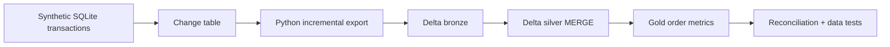

# Project 2 — Operational database to lakehouse

**Status: planned.** Simulate an operational system, then turn its changes into reliable analytical tables using Python, Databricks, Spark, and Delta Lake. All customers, products, and orders are **synthetic** and generated deterministically. This project demonstrates incremental data engineering; it does not claim access to a real employer system.

## Question and design

Can an analytical system reflect inserts, updates, and deletes from an operational database without losing or duplicating changes? Start with SQLite locally so the source is easy to reproduce. Build a small append-only change table or outbox with a monotonic event ID. Extract changes in bounded batches. Upload a small batch to Databricks Free Edition, then build bronze, silver, and gold Delta tables. This outbox is a simulation of source changes, **not log-based CDC**.

## Milestone 1 — Local source and extraction

- Generate deterministic customers, products, and orders. Record inserts, updates, and deletes in a change table.
- Implement an extractor that checkpoints the last successfully exported event. State whether delivery is at-least-once and how the destination removes duplicates.
- Demonstrate an empty batch, a normal batch, an interrupted run, and replay after restart without missing changes.

**Review gate:** all source events are represented once in the logical target state after replay; provide a query or test proving it.

## Milestone 2 — Delta processing

- Load a small exported batch into a bronze table in [Databricks Free Edition](https://docs.databricks.com/aws/en/getting-started/free-edition). Use only synthetic data. The free tier has [quotas and network limits](https://docs.databricks.com/aws/en/getting-started/free-edition-limitations), so local export and upload are acceptable.
- Apply changes to a silver current-state table with Delta `MERGE`; define delete behavior. Build a gold aggregate for order count and revenue, with explicit handling for cancellations.
- Check event uniqueness, expected current-state counts, null keys, and source-to-target totals. Show how a late event or replay behaves.

**Review gate:** two runs with the same input produce the same silver state and gold metrics; an update and a delete change those metrics as expected.

## Milestone 3 — Operation and explanation

- Run the Databricks transformation as a Job. Record how to trigger it, identify its run, inspect failures, and rerun safely.
- Document the incremental watermark, schema, data tests, reconciliation queries, resource limits, and what would change for a production source.

**Done when:** another engineer can create the synthetic source, export changes, load them into Databricks, reproduce the tables, recover a failed/replayed batch, and verify the same final state.
