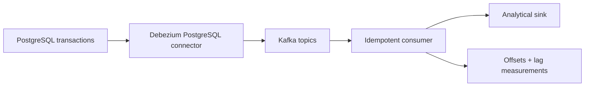

# Log-based CDC and streaming

**Status: Planned extension.** Implementation follows the core batch and incremental pipelines.

## Problem

The batch change feed in the operational-to-lakehouse project exports application-maintained events. This extension will examine a different source boundary: capturing committed database changes from PostgreSQL's log and delivering them to an analytical sink with measurable delay and recoverable processing.

## Proposed architecture

The [Debezium PostgreSQL connector](https://debezium.io/documentation/reference/stable/connectors/postgresql.html) will capture an initial snapshot and subsequent row changes. Messages will be keyed by source primary key; the consumer will apply them idempotently and commit offsets only after the sink confirms the write. Ordering will be specified per key or partition rather than assumed globally. Generated data will isolate the experiment from private systems. The [Debezium tutorial](https://debezium.io/documentation/reference/stable/tutorial.html) supplies the container-based starting topology.

## Implementation milestones

1. **Source and topology:** reproducible PostgreSQL, Debezium, Kafka, and sink configuration on a documented container-capable host.
2. **Change propagation:** initial snapshot followed by insert, update, and delete cases, including message keys and schema handling.
3. **Recovery and measurement:** consumer interruption, replay, offset recovery, final-state reconciliation, and a repeatable source-to-sink lag experiment.

## Acceptance criteria

- Snapshot and subsequent mutations produce the expected sink state, including deletion.
- Restart and replay leave the final state correct without duplicate logical records.
- The documentation states delivery semantics, checkpoint ownership, ordering boundary, and behavior for malformed events.
- Reported lag includes workload, sample size, timestamp definitions, measurement method, and clock limitations.
- A clean-host runbook starts and stops the topology and reproduces its validation checks once implemented.

## Scope and tradeoffs

The extension focuses on correctness and observed latency for a small synthetic workload. It requires a container-capable host to reproduce the full topology. Production deployment would require separate availability, security, and recovery requirements.
